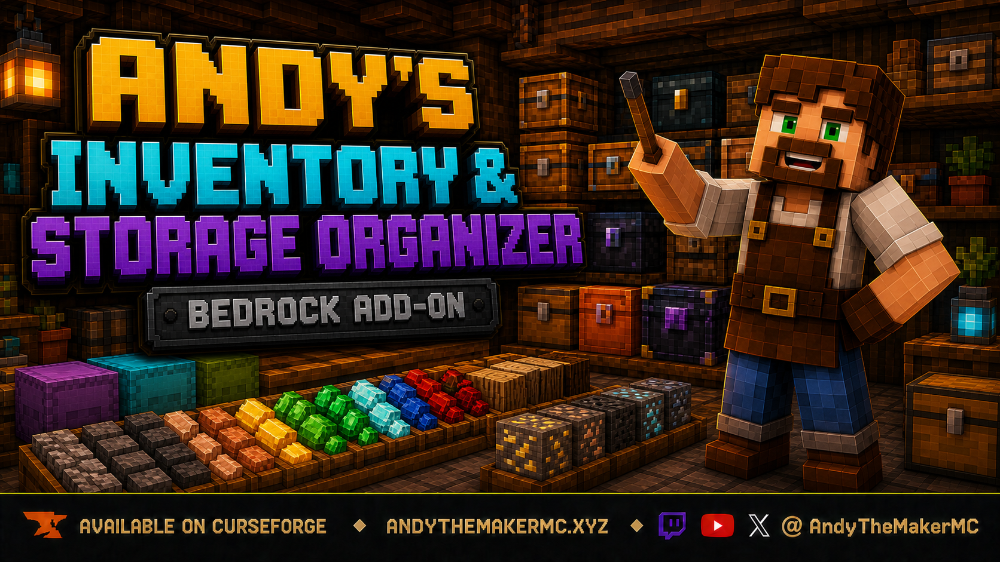

  

# Andy's Inventory & Storage Organizer

**Sort what you carry. Organize where you store it. Keep every slot under your control.**

Andy's Inventory & Storage Organizer adds a crafted Organizer Wand for safe, configurable personal-inventory and vanilla-storage cleanup in Minecraft Bedrock. Sort, restack, pin slots, preserve layouts, protect hotbar gaps, Quick Stack into matching container stacks, or organize supported storage when it closes.

**Current release:** 0.1.6  
**Download:** [Andys_Inventory_Storage_Organizer_0.1.6.mcaddon](Andys_Inventory_Storage_Organizer_0.1.6.mcaddon)  
**SHA-256:** `8873E228D518AD1FEDC7C1D30DAB385310123EF3387A4D018417AB96AF05C324`

Minecraft Bedrock **26.30 or newer** is required. Cheats and experimental gameplay toggles are not required. Standard graphics and Vibrant Visuals are supported.

Version 0.1.6 fixes storage wand interactions being replaced by the personal menu. It also replaces click-to-cycle options with clear toggles/dropdowns, named Save actions, and visible save confirmations.

See the [project wiki](https://github.com/CharlesJGantt/Andys-Inventory-Storage-Organizer/wiki) for the complete player guide and troubleshooting reference.

## Features

- One crafted Organizer Wand: Charcoal above two vertical Sticks
- Organize Now, Restack Only, and opt-in Always Organize
- Eight sorting rules for blocks, categories, resources, tools, food, redstone, alphabetical order, and largest stacks
- Preserve or Sort hotbar modes
- Separate default-off Compact Hotbar toggle
- Pins for every personal and storage slot, including empty positions
- Five named personal layouts and five named layouts per storage coordinate
- Safe, snapshot-guarded undo for recent pure rearrangements
- Chests, Trapped Chests, Barrels, Copper Chest variants, and all Shulker Boxes
- Quick Stack into compatible stacks already present in storage
- Opt-in Sort on Close for individual containers
- Adjacent-hopper and locked-container fail-closed protection
- Compatibility guards for Handy Hotbar Reloader and Palette Paver
- Opt-in Creator Content Log diagnostics
- Multiplayer, Realm, and supported-server ready

## Install

1. Download and open `Andys_Inventory_Storage_Organizer_0.1.6.mcaddon` with Minecraft Bedrock.
2. Wait for Minecraft to report a successful import.
3. Edit the desired world and activate **Andy's Inventory & Storage Organizer** under Behavior Packs.
4. Its mutually linked Resource Pack activates with it.
5. Confirm both packs show version 0.1.6, then enter the world.
6. Obtain Charcoal and craft the Organizer Wand above two Sticks in a Crafting Table.

Back up important worlds before installing or updating any add-on. Console players can import and configure the world on Windows or mobile, upload it to a Realm, then join from their console.

## Controls

- **Crouch + use in open air:** open Personal Inventory Settings.
- **Crouch + use on supported storage:** open Storage Organizer for that container.

The Organizer Wand is a custom item. A renamed ordinary stick will not open its menus.

Use **Personal Settings** or **Storage Settings** for configurable values. Press the named Save button to apply them; cancelling changes nothing. The confirmation and returned status screen show the stored values.

## Hotbar behavior

| Setting | Result |
|---|---|
| **Preserve** | Default; every hotbar position remains fixed, including empty positions |
| **Sort + Compact Off** | Occupied hotbar positions can participate in sorting, but gaps remain empty |
| **Sort + Compact On** | Hotbar gaps may be filled during the whole-inventory sort |

Always Organize never enables hotbar sorting or compaction by itself.

## Saved layouts and pins

Pins hold any occupied or empty position fixed. Saved layouts record targets for non-empty positions while saved empty positions remain sortable. Layouts move only matching items already present; they do not create missing supplies or pull from external storage.

Layout matching uses the item identifier and custom name. When several matching enchanted or component-bearing items exist, review the resulting arrangement before relying on a precise individual copy.

## Storage behavior

Supported vanilla storage receives its own settings, sorting rule, pins, layouts, Quick Stack, undo, and Sort on Close toggle. Configuration belongs to the block's dimension and coordinates rather than following the container if it is broken and moved.

Quick Stack fills compatible non-full stacks already present in the selected storage. It does not seed empty storage slots with new item types.

## Safety

Whole stacks are rearranged with native slot swaps. Partial-stack transfers debit the source before crediting the destination and verify totals. Sorting stops when the live inventory no longer matches its planned snapshot.

The Organizer refuses storage operations when a hopper is directly adjacent or Andy's Locks & Keys exposes a coordinate lock. Undo also refuses to overwrite an inventory that changed after the recorded sort.

## Companion compatibility

- **Andy's Handy Hotbar Reloader:** when detected managing a slot, the Organizer protects the full hotbar.
- **Andy's Palette Paver:** detection of the `Palette Paver` stick protects its entire nine-slot working hotbar.
- **Andy's Locks & Keys:** locked vanilla storage fails closed; no lock bypass is attempted.
- **Andy's Explorer's Backpack:** off-hand equipment and custom backpack storage remain outside Organizer targeting.
- **Andy's Portable Campsite:** uses separate identifiers; organize stable vanilla storage only after the campsite is fully open.

Test combinations of automatic inventory add-ons in a backed-up world. Two systems can have different goals even when both preserve item totals.

## Follow and support Andy

- Website: [AndyTheMakerMC.xyz](https://AndyTheMakerMC.xyz)
- YouTube: [@AndyTheMakerMC](https://www.youtube.com/@AndyTheMakerMC)
- Twitch: [@AndyTheMakerMC](https://twitch.tv/AndyTheMakerMC)
- X: [@AndyTheMakerMC](https://x.com/AndyTheMakerMC)
- TikTok: [@AndyTheMakerMC](https://www.tiktok.com/@AndyTheMakerMC)
- Instagram: [@AndyTheMakerMC](https://www.instagram.com/AndyTheMakerMC)
- Donate: [Ko-fi](https://ko-fi.com/andythemaker) or [direct Stripe support](https://buy.stripe.com/4gM4gz0qu0xwgxw0IfcMM00)

## Permission and license

Players, servers, Realms, and content creators may use and showcase the official, unmodified release as described in [LICENSE.md](LICENSE.md), including monetized original gameplay content. Redistribution, rehosting, repackaging, modification and publication, reverse engineering, extraction, resale, sublicensing, and reuse are not permitted without prior written permission.

Minecraft is a trademark of Microsoft Corporation. This project is not affiliated with, endorsed by, sponsored by, or associated with Microsoft or Mojang Studios.
